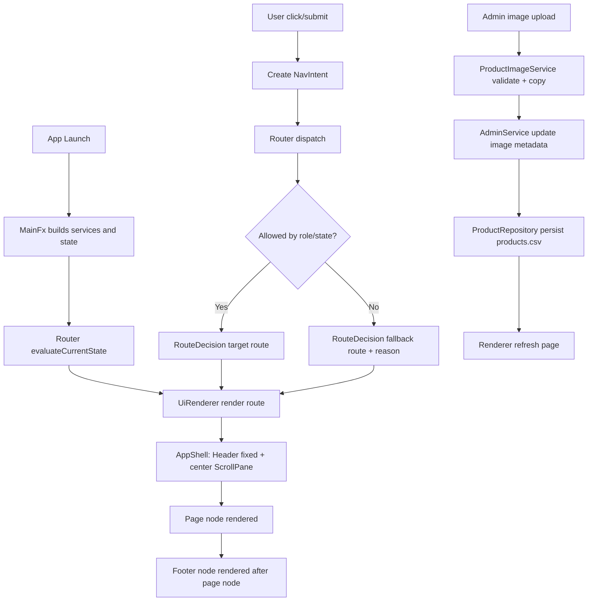

# Step 5 Implementation Guide
# JavaFX SPA Router + Product Image Refactor

Last updated: 2026-04-27
Status: Planning and implementation guide

## 1) Why this file exists
This document explains the full Step 5 migration in plain language so a new team member can read it and understand:
- what we are building,
- why we are building it this way,
- where code should go,
- what classes need to exist,
- and in what order we should implement everything.

This is both:
- architecture documentation,
- and execution checklist.

## 2) Executive summary
We are moving from a console UI loop to a JavaFX desktop frontend with SPA-style behavior.

The new UI model is:
1. one window (`Stage`),
2. one shell layout,
3. fixed header at top,
4. dynamic page content in center,
5. footer always present at the bottom of page content (not sticky),
6. route decision made by a custom router based on app state.

The old `while` loop behavior from console is preserved conceptually as:
`intent -> router decision -> renderer swaps page`.

## 3) Current vs target architecture

Current:
- Console interaction in menu loops.
- Navigation is done through numeric options.
- Rendering is text output in terminal.

Target:
- JavaFX event-driven navigation.
- Navigation based on route/state, not scanner input loops.
- Rendering through JavaFX Nodes.
- Same service and repository business logic reused underneath.

## 4) Core UI rules (non-negotiable)
1. Header is fixed in the top region and is always visible.
2. Main page content is route-driven and replaced by renderer.
3. Footer is always rendered as part of page flow at the bottom.
4. Footer is not fixed to viewport bottom.
5. On long pages, users scroll to reach footer.

## 5) Runtime baseline
- JDK 17+.
- Maven wrapper in repository root.
- JavaFX dependencies managed by Maven.
- IntelliJ can open this repository directly as a Maven project.

## 6) Exact target structure and files
Legend:
- `*` modified existing file
- `**` new file

```text
.
|-- README.md *
|-- STEP3_CSV_PERSISTENCE_IMPLEMENTATION.md
|-- STEP5_JAVAFX_SPA_ROUTER_AND_IMAGE_REFACTOR_SPEC.md *
|-- pom.xml *
|-- mvnw *
|-- mvnw.cmd *
|-- .mvn/wrapper/*
|-- data
|   |-- users.csv
|   |-- products.csv *
|   |-- orders.csv
|   |-- order_items.csv
|   `-- images **
|       `-- .gitkeep **
`-- src
    `-- com/university/shopping
        |-- Main.java
        |-- Launcher.java *
        |-- MainFx.java *
        |-- app **
        |   |-- AppState.java **
        |   |-- Route.java **
        |   |-- NavIntentType.java **
        |   |-- NavIntent.java **
        |   |-- RouteDecision.java **
        |   `-- Router.java **
        |-- dto **
        |   `-- ProductImageUpdateRequest.java **
        |-- model
        |   |-- MockDatabase.java *
        |   |-- Product.java *
        |   |-- User.java
        |   |-- Order.java
        |   |-- OrderItem.java
        |   `-- Cart.java
        |-- repository
        |   |-- CsvBootstrapInitializer.java *
        |   |-- CsvPersistenceUtil.java *
        |   |-- ProductRepository.java *
        |   |-- UserRepository.java
        |   |-- OrderRepository.java
        |   |-- CartRepository.java
        |   `-- ErrorLogger.java
        |-- service
        |   |-- AuthService.java *
        |   |-- ShopService.java *
        |   |-- AdminService.java *
        |   |-- media **
        |   |   `-- ProductImageService.java **
        |   |-- pricing/*
        |   `-- report/*
        `-- view
            |-- ConsoleUI.java *
            |-- contracts
            |   |-- MenuActions.java *
            |   |-- ScreenComponent.java **
            |   `-- ScreenContext.java **
            |-- renderer
            |   `-- UiRenderer.java **
            |-- layout
            |   `-- AppShell.java **
            |-- components
            |   |-- HeaderNavComponent.java **
            |   |-- FooterComponent.java **
            |   |-- NotificationBarComponent.java **
            |   `-- ProductCardComponent.java **
            |-- pages
            |   |-- LoginPage.java **
            |   |-- RegisterPage.java **
            |   |-- GuestProductsPage.java **
            |   |-- CustomerProductsPage.java **
            |   |-- ProductDetailsPage.java **
            |   |-- CartPage.java **
            |   |-- CheckoutPage.java **
            |   |-- AdminProductsPage.java **
            |   |-- AdminProductEditorPage.java **
            |   |-- AdminUsersPage.java **
            |   `-- AdminReportsPage.java **
            |-- screens
            |   |-- AbstractScreen.java *
            |   |-- AuthScreen.java *
            |   |-- CustomerScreen.java *
            |   `-- AdminScreen.java *
            `-- styles
                |-- app.css **
                `-- theme.css **
```

## 7) Router + renderer model

## 7.1 Layout model
Root is `BorderPane`:
- `top`: header nav component (fixed)
- `center`: `ScrollPane`
  - content is `VBox pageFlow`
  - `pageFlow` always has two main parts in order:
    1) active page node
    2) footer node

## 7.2 Route loop model
JavaFX is event-driven, so this replaces console while-loop:

1. User action creates `NavIntent`.
2. Router evaluates user state and permissions.
3. Router returns `RouteDecision`.
4. Renderer swaps page content.
5. Optional lifecycle hooks run (`onBeforeLeave`, `onAfterEnter`).

## 7.3 Access guards
- Guest routes only when not logged in.
- Customer routes require logged-in non-admin user.
- Admin routes require admin user.
- Invalid route request is redirected with user-visible reason.

## 8) Route map and page map

## 8.1 Route IDs
- `AUTH_LOGIN`
- `AUTH_REGISTER`
- `GUEST_PRODUCTS`
- `CUSTOMER_PRODUCTS`
- `CUSTOMER_PRODUCT_DETAILS`
- `CUSTOMER_CART`
- `CUSTOMER_CHECKOUT`
- `ADMIN_PRODUCTS`
- `ADMIN_PRODUCT_EDITOR`
- `ADMIN_USERS`
- `ADMIN_REPORTS`

## 8.2 Route ownership map
- `AuthScreen` owns: login, register, guest products
- `CustomerScreen` owns: products, details, cart, checkout
- `AdminScreen` owns: admin products, editor, users, reports

## 8.3 Google Stitch prompt (copy and paste)
```text
Design a desktop e-commerce UI for JavaFX with SPA behavior.

Layout:
- Fixed top header navigation that is always visible.
- Route-driven main content area.
- Footer always present at the bottom of page content (not sticky).
- On long pages users scroll down to reach footer.

Pages:
1) Login
2) Register
3) Guest product catalog (read-only)
4) Customer product catalog
5) Product details
6) Cart
7) Checkout confirmation
8) Admin products table with actions
9) Admin product editor (create/edit)
10) Admin users management
11) Admin reports

Header:
- Left: brand.
- Center: route tabs based on auth role.
- Right: user badge + logout.

Footer:
- Support links, version, copyright.
- Appears after content in scroll flow.

Product image requirements:
- Product cards and details show thumbnails.
- Fallback placeholder when image missing.
- Admin product editor supports upload/replace/remove image.
- Show image name and saved path.
- Validate file extensions: png, jpg, jpeg, webp.

Visual direction:
- Modern electronics store.
- Clear hierarchy for product and admin data.
- Strong feedback banners for success/error actions.
```

## 9) Product image refactor across layers

## 9.1 Product model fields
Add to `Product`:
- `imageName` (string shown in UI)
- `imagePath` (relative path persisted in CSV)

## 9.2 CSV schema change
Old `products.csv` header:
```csv
id,name,price,category,description,stockQuantity,isDiscounted,discountPercentage
```

New header:
```csv
id,name,price,category,description,stockQuantity,isDiscounted,discountPercentage,imageName,imagePath
```

Backward compatibility:
- If row has 8 columns, default image fields to empty strings.

## 9.3 File storage policy
- Store image files under `data/images/`.
- Persist only relative path, never machine-specific absolute path.
- Remove file on delete/replace as best effort.

## 10) Class reference (new classes)

All signatures below are target contracts.

## 10.1 `MainFx`
Package: `com.university.shopping`

Purpose:
- JavaFX entry application.
- Builds dependency graph and root shell.

Fields:
- `AuthService authService`
- `ShopService shopService`
- `AdminService adminService`
- `AppState appState`
- `Router router`
- `UiRenderer renderer`

Methods:
- `void start(Stage stage)`
  - Params: `Stage stage`
  - Returns: `void`
  - Does: initialize app, create scene, render initial route.
- `static void main(String[] args)`
  - Params: `String[] args`
  - Returns: `void`
  - Does: launch JavaFX app.

## 10.2 `AppState`
Package: `com.university.shopping.app`

Purpose:
- Single source of UI state.

Fields:
- `User currentUser`
- `Route currentRoute`
- `Integer selectedProductId`
- `String flashMessage`
- `boolean loading`

Methods:
- `User getCurrentUser()`
- `void setCurrentUser(User user)`
- `Route getCurrentRoute()`
- `void setCurrentRoute(Route route)`
- `Integer getSelectedProductId()`
- `void setSelectedProductId(Integer id)`
- `String consumeFlashMessage()`
  - Returns current flash message and clears it.

## 10.3 `Route`
Package: `com.university.shopping.app`

Purpose:
- Canonical route enum.

Fields:
- Enum constants from section 8.1.

Methods:
- Enum default methods only.

## 10.4 `NavIntentType`
Package: `com.university.shopping.app`

Purpose:
- Classifies navigation intent.

Fields:
- `APP_START`
- `OPEN_ROUTE`
- `OPEN_PRODUCT_DETAILS`
- `LOGIN_SUCCESS`
- `REGISTER_SUCCESS`
- `CHECKOUT_SUCCESS`
- `LOGOUT`
- `FORBIDDEN`

Methods:
- Enum default methods only.

## 10.5 `NavIntent`
Package: `com.university.shopping.app`

Purpose:
- Immutable navigation input to router.

Fields:
- `NavIntentType type`
- `Route requestedRoute`
- `Integer productId`
- `String message`

Methods:
- `static NavIntent appStart()`
- `static NavIntent open(Route route)`
- `static NavIntent openProduct(int productId)`
- `static NavIntent loginSuccess()`
- Getters for all fields

Method returns:
- all factory methods return `NavIntent`.

## 10.6 `RouteDecision`
Package: `com.university.shopping.app`

Purpose:
- Output of route evaluation.

Fields:
- `Route route`
- `String reason`
- `boolean allowed`

Methods:
- `Route getRoute()`
- `String getReason()`
- `boolean isAllowed()`

## 10.7 `Router`
Package: `com.university.shopping.app`

Purpose:
- State-aware and role-aware route decision engine.

Fields:
- `AppState appState`
- `AuthService authService`

Methods:
- `RouteDecision dispatch(NavIntent intent)`
  - Params: `NavIntent intent`
  - Returns: `RouteDecision`
  - Does: resolve final target route.
- `RouteDecision evaluateCurrentState()`
  - Params: none
  - Returns: `RouteDecision`
  - Does: route check equivalent to old loop.
- `boolean canAccess(Route route)`
  - Params: `Route route`
  - Returns: `boolean`
  - Does: role and auth guard.

## 10.8 `ScreenComponent`
Package: `com.university.shopping.view.contracts`

Purpose:
- Common contract for screen wrappers.

Methods:
- `Node render(ScreenContext context)`
  - Params: `ScreenContext context`
  - Returns: `Node`
  - Does: build and return root node.
- `default void onAfterEnter(ScreenContext context)`
- `default void onBeforeLeave(ScreenContext context)`

## 10.9 `ScreenContext`
Package: `com.university.shopping.view.contracts`

Purpose:
- Shared dependency container for screens/pages.

Fields:
- `AppState appState`
- `Router router`
- `UiRenderer renderer`
- `AuthService authService`
- `ShopService shopService`
- `AdminService adminService`
- `ProductImageService productImageService`

Methods:
- Getter for each field.

## 10.10 `UiRenderer`
Package: `com.university.shopping.view.renderer`

Purpose:
- Route-to-screen resolution and center content swap.

Fields:
- `AppShell appShell`
- `ScreenComponent activeScreen`

Methods:
- `void render(Route route, ScreenContext context)`
  - Params: `Route route`, `ScreenContext context`
  - Returns: `void`
  - Does: swap active page and run lifecycle hooks.
- `void setNotification(String message, boolean error)`
  - Params: message and error flag
  - Returns: `void`
- `ScreenComponent resolveScreen(Route route)`
  - Params: `Route route`
  - Returns: `ScreenComponent`

## 10.11 `AppShell`
Package: `com.university.shopping.view.layout`

Purpose:
- Own stable regions and enforce header/footer behavior.

Fields:
- `BorderPane root`
- `HeaderNavComponent header`
- `ScrollPane scrollRoot`
- `VBox pageFlow`
- `FooterComponent footer`

Methods:
- `Parent buildRoot(ScreenContext context)`
  - Params: `ScreenContext context`
  - Returns: `Parent`
  - Does: create full shell.
- `void setPageContent(Node pageNode)`
  - Params: `Node pageNode`
  - Returns: `void`
  - Does: keep child order `[pageNode, footer]`.
- `BorderPane getRoot()`
  - Returns: shell root.

## 10.12 `HeaderNavComponent`
Package: `com.university.shopping.view.components`

Purpose:
- Top navigation with role-aware links.

Fields:
- `HBox root`
- `Label userBadge`

Methods:
- `Node render(ScreenContext context)`
- `void refresh(ScreenContext context)`

## 10.13 `FooterComponent`
Package: `com.university.shopping.view.components`

Purpose:
- Footer content rendered at bottom of page flow.

Fields:
- `VBox root`

Methods:
- `Node render(ScreenContext context)`

## 10.14 `NotificationBarComponent`
Package: `com.university.shopping.view.components`

Purpose:
- Success/error banner component.

Fields:
- `HBox root`
- `Label messageLabel`

Methods:
- `Node getNode()`
- `void showSuccess(String message)`
- `void showError(String message)`
- `void clear()`

## 10.15 `ProductCardComponent`
Package: `com.university.shopping.view.components`

Purpose:
- Reusable catalog card.

Fields:
- `Product product`

Methods:
- `Node render(ScreenContext context)`

## 10.16 Page classes
Package: `com.university.shopping.view.pages`

All page classes use the same main contract:
- `Node render(ScreenContext context)`
  - Params: `ScreenContext context`
  - Returns: `Node`
  - Does: build page node and bind all events.

Classes:
- `LoginPage`
- `RegisterPage`
- `GuestProductsPage`
- `CustomerProductsPage`
- `ProductDetailsPage`
- `CartPage`
- `CheckoutPage`
- `AdminProductsPage`
- `AdminProductEditorPage`
- `AdminUsersPage`
- `AdminReportsPage`

Page responsibilities:
- own controls and event listeners,
- call service methods,
- emit router intents on transitions,
- show notification messages.

## 10.17 `ProductImageUpdateRequest`
Package: `com.university.shopping.dto`

Purpose:
- DTO for admin image operations.

Fields:
- `int productId`
- `String sourceFilePath`
- `String imageName`

Methods:
- constructor
- getters

## 10.18 `ProductImageService`
Package: `com.university.shopping.service.media`

Purpose:
- Validates, copies, removes product image files.

Fields:
- `String imageRootDir`
- `Set<String> allowedExtensions`

Methods:
- `String storeProductImage(ProductImageUpdateRequest request)`
  - Params: DTO request
  - Returns: stored relative path
  - Does: validate extension and copy file.
- `boolean removeProductImage(String relativePath)`
  - Returns: delete status
- `boolean isSupportedImage(String fileName)`
  - Returns: extension validity

## 11) Existing classes to modify (summary)

## 11.1 `Product`
Add fields and accessors:
- `imageName`
- `imagePath`

## 11.2 `CsvPersistenceUtil`
Update write logic for new product columns.

## 11.3 `CsvBootstrapInitializer`
Parse 10-column product rows with fallback for 8-column legacy rows.

## 11.4 `ProductRepository`
Add image metadata mutation methods and persist CSV.

## 11.5 `AdminService`
Add methods:
- `setProductImage(...)`
- `removeProductImage(...)`

## 11.6 `ShopService`
No major behavior change required.
Existing product retrieval will expose image fields.

## 11.7 `ConsoleUI`
Keep temporarily for fallback console run mode during migration.

## 11.8 `AuthScreen`, `CustomerScreen`, `AdminScreen`, `AbstractScreen`
Refactor from console rendering to JavaFX screen wrappers.

## 12) Phased implementation plan

Phase 1: Foundation
- Add app state, routes, intents, router, route decision.
- Add shell and renderer.
- Confirm header/footer behavior.

Phase 2: Auth and guest catalog
- Implement login, register, guest products pages.
- Add route guards and redirects.

Phase 3: Customer flow
- Add customer products, details, cart, checkout pages.

Phase 4: Admin flow
- Add admin products, product editor, users, reports pages.

Phase 5: Product image refactor
- Add model fields, CSV schema changes, service/repo logic, admin upload/remove.

Phase 6: Stabilization
- Regression tests, manual UX checks, route guard checks, CSV compatibility checks.

## 13) Test checklist
1. Launch JavaFX app and see shell render.
2. Header always visible during route changes.
3. Footer appears at end of content and is scroll-reachable on long pages.
4. Guest cannot access customer/admin routes.
5. Customer cannot access admin routes.
6. Admin routes open after admin login.
7. Product image upload writes file and updates CSV.
8. Product image remove updates CSV and deletes file best effort.
9. Old `products.csv` rows without image columns still load.

## 14) High-order flowchart


## 15) TODO list (implementation order)
1. Create app core classes (`AppState`, `Route`, `NavIntent`, `Router`, `RouteDecision`).
2. Create shell and renderer (`AppShell`, `UiRenderer`).
3. Implement auth and guest pages.
4. Implement customer pages.
5. Implement admin pages.
6. Add product image data fields and CSV support.
7. Add image file service and admin image workflows.
8. Add route guard messages and notification bars.
9. Run manual and persistence regression checks.

## 16) Definition of done
- JavaFX app runs from repository as Maven project.
- Router-driven navigation works for guest/customer/admin.
- Header fixed at top in all routes.
- Footer always rendered at content bottom and scroll-reachable.
- Product images can be uploaded/removed by admin and are persisted.
- Existing core business behavior remains correct.
