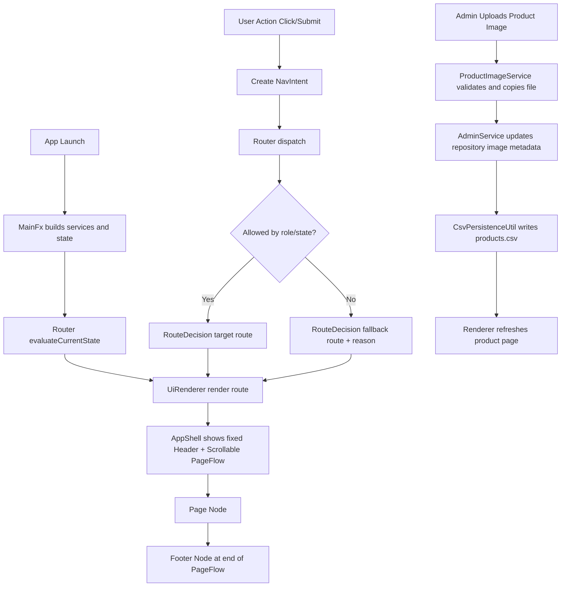

# Step 5 Implementation Specification (JavaFX SPA Router + Product Images)

## 0) Goal and Requirement Mapping
This document defines the Step 5 target architecture for migrating the current console view into a JavaFX single-window, route-driven UI with componentized pages and persistent product images.

Step 5 requirement coverage from discussion:
1. Keep screen-level architecture and move to a state-driven router (console loop equivalent).
2. Keep header navigation always visible at the top.
3. Add a footer component that is always part of the page output but not sticky: users scroll to reach it on long pages.
4. Add component-per-file organization with local event listeners and UI rules.
5. Add image metadata across model, repository, services, and admin workflows.
6. Provide one complete implementation plan and class contract map in a single file.

Core architectural decision:
- The old `while` loop in console becomes an event-driven route loop:
  - intent -> router decision -> renderer swap -> page lifecycle hooks

Footer behavior decision (critical):
- Header is fixed at top.
- Footer is rendered as the last element of scrollable page content.
- Footer is not fixed to viewport bottom.

## 1) Exact Target Project Structure and Files
Legend:
- `*` modified existing file
- `**` new file

```text
.
|-- STEP3_CSV_PERSISTENCE_IMPLEMENTATION.md
|-- STEP5_JAVAFX_SPA_ROUTER_AND_IMAGE_REFACTOR_SPEC.md **
|-- README.md *
|-- data
|   |-- users.csv
|   |-- products.csv *
|   |-- orders.csv
|   |-- order_items.csv
|   `-- images **
|       `-- .gitkeep **
`-- src
    `-- com/university/shopping
        |-- Main.java *
        |-- MainFx.java **
        |-- app **
        |   |-- AppState.java **
        |   |-- Route.java **
        |   |-- NavIntentType.java **
        |   |-- NavIntent.java **
        |   |-- RouteDecision.java **
        |   `-- Router.java **
        |-- dto **
        |   `-- ProductImageUpdateRequest.java **
        |-- model
        |   |-- MockDatabase.java *
        |   |-- Product.java *
        |   |-- User.java
        |   |-- Order.java
        |   |-- OrderItem.java
        |   `-- Cart.java
        |-- repository
        |   |-- CsvBootstrapInitializer.java *
        |   |-- CsvPersistenceUtil.java *
        |   |-- ProductRepository.java *
        |   |-- UserRepository.java
        |   |-- OrderRepository.java
        |   |-- CartRepository.java
        |   `-- ErrorLogger.java
        |-- service
        |   |-- AuthService.java *
        |   |-- ShopService.java *
        |   |-- AdminService.java *
        |   |-- media **
        |   |   `-- ProductImageService.java **
        |   |-- pricing
        |   |   |-- DiscountPolicy.java
        |   |   |-- StandardDiscountPolicy.java
        |   |   |-- SeasonalDiscountPolicy.java
        |   |   `-- PricingModeConstants.java
        |   `-- report
        |       |-- AbstractReportService.java
        |       |-- ConsoleReportService.java
        |       `-- CsvReportService.java
        `-- view
            |-- ConsoleUI.java *
            |-- contracts
            |   |-- MenuActions.java *
            |   |-- ScreenComponent.java **
            |   `-- ScreenContext.java **
            |-- renderer **
            |   `-- UiRenderer.java **
            |-- layout **
            |   `-- AppShell.java **
            |-- components **
            |   |-- HeaderNavComponent.java **
            |   |-- FooterComponent.java **
            |   |-- NotificationBarComponent.java **
            |   `-- ProductCardComponent.java **
            |-- pages **
            |   |-- LoginPage.java **
            |   |-- RegisterPage.java **
            |   |-- GuestProductsPage.java **
            |   |-- CustomerProductsPage.java **
            |   |-- ProductDetailsPage.java **
            |   |-- CartPage.java **
            |   |-- CheckoutPage.java **
            |   |-- AdminProductsPage.java **
            |   |-- AdminProductEditorPage.java **
            |   |-- AdminUsersPage.java **
            |   `-- AdminReportsPage.java **
            |-- screens
            |   |-- AbstractScreen.java *
            |   |-- AuthScreen.java *
            |   |-- CustomerScreen.java *
            |   `-- AdminScreen.java *
            `-- styles **
                |-- app.css **
                `-- theme.css **
```

## 2) Router and Rendering Model

## 2.1 Why this model fits JavaFX
- JavaFX is event-driven, not command-loop driven.
- Router plus AppState reproduces console loop behavior safely:
  - current state and intent determine the next page.
- UiRenderer swaps only the content area, not the whole window.

## 2.2 App shell composition
- Root layout: `BorderPane`
- `top`: fixed header nav component
- `center`: `ScrollPane`
  - content: `VBox`
  - first child: current page content
  - last child: footer component

Result:
- Header always visible.
- Footer always present at bottom of page content.
- Footer is naturally reached by scrolling when content is long.

## 2.3 Route lifecycle
1. UI event emits `NavIntent`.
2. `Router.dispatch(intent)` evaluates state and permissions.
3. Router returns `RouteDecision`.
4. `UiRenderer.render(decision.route)` swaps page node.
5. Optional hooks run: `onBeforeLeave` for old page, `onAfterEnter` for new page.

## 3) Page Map for Design and Routing

## 3.1 Route enum map
- `AUTH_LOGIN`
- `AUTH_REGISTER`
- `GUEST_PRODUCTS`
- `CUSTOMER_PRODUCTS`
- `CUSTOMER_PRODUCT_DETAILS`
- `CUSTOMER_CART`
- `CUSTOMER_CHECKOUT`
- `ADMIN_PRODUCTS`
- `ADMIN_PRODUCT_EDITOR`
- `ADMIN_USERS`
- `ADMIN_REPORTS`

## 3.2 Route to screen ownership map
- `AuthScreen`: login, register, guest products
- `CustomerScreen`: customer products, product details, cart, checkout
- `AdminScreen`: admin products, editor, users, reports

## 3.3 Google Stitch prompt (copy-paste ready)
```text
Design a desktop e-commerce UI system for JavaFX (single window, single-page-app behavior).

Global layout:
- Fixed top header navigation, always visible.
- Main content area changes by route/state.
- Footer is always rendered as the last block of page content, not sticky; on long pages user scrolls to reach footer.
- Visual style: clean modern electronics store, high information density, table + card hybrid.

Routes/pages:
1) Login page
2) Register page
3) Guest product catalog (read-only)
4) Customer product catalog
5) Product details page
6) Cart page
7) Checkout confirmation page
8) Admin products page (table with actions)
9) Admin product editor page (create/edit product)
10) Admin users page
11) Admin reports page

Header behavior:
- Left: brand/logo.
- Center: route tabs based on role and auth state.
- Right: current user badge and logout button.

Footer behavior:
- Show support links, copyright, version, and report export quick action.
- Footer appears after page content inside the scroll flow.

Admin product image workflow UI:
- Product editor includes image picker/upload area.
- Show image preview, image filename, and saved relative path.
- Buttons: Upload/Replace Image, Remove Image.
- Validate file type: png, jpg, jpeg, webp.

Product cards and details:
- Show product image thumbnail (fallback placeholder if absent).
- Show name, category, price, discount badge, and stock.

Interaction style:
- Route transitions should feel instant and structured.
- Use visible success/error banners for operations.
- Keep controls compact and productivity-focused for admin pages.
```

## 4) Data and Persistence Refactor for Product Images

## 4.1 Product model changes
Add fields to `Product`:
- `private String imageName;`
- `private String imagePath;`

Notes:
- `imagePath` is a relative runtime path, example: `data/images/product_7_phone-front.jpg`.
- `imageName` is human-friendly name shown in UI.

## 4.2 CSV schema update
Current header:
```csv
id,name,price,category,description,stockQuantity,isDiscounted,discountPercentage
```

New header:
```csv
id,name,price,category,description,stockQuantity,isDiscounted,discountPercentage,imageName,imagePath
```

Backward compatibility rule:
- If row has only 8 columns, default `imageName=""`, `imagePath=""`.

## 4.3 Runtime image storage policy
- Images copied into `data/images/`.
- Persist relative path in CSV.
- Never persist absolute machine-specific paths.
- Deleting product image should remove stored file (best effort).

## 5) Class-by-Class Contracts (New Classes)

Each class below includes purpose, fields, and method contracts.

## 5.1 `MainFx`
Purpose:
- JavaFX entry point and UI bootstrap.

Key fields:
- `private Router router;`
- `private UiRenderer renderer;`
- `private AppState appState;`

Methods:
- `public void start(Stage stage)`
  - Params: `Stage stage`
  - Returns: `void`
  - Behavior: creates DI graph, app shell, router wiring, initial route render.
- `public static void main(String[] args)`
  - Params: `String[] args`
  - Returns: `void`
  - Behavior: launches JavaFX runtime.

## 5.2 `AppState`
Purpose:
- Central mutable state for auth, role, and active route context.

Fields:
- `private User currentUser;`
- `private Route currentRoute;`
- `private Integer selectedProductId;`
- `private String flashMessage;`
- `private boolean loading;`

Methods:
- `public User getCurrentUser()` -> `User`
- `public void setCurrentUser(User user)` -> `void`
- `public Route getCurrentRoute()` -> `Route`
- `public void setCurrentRoute(Route route)` -> `void`
- `public Integer getSelectedProductId()` -> `Integer`
- `public void setSelectedProductId(Integer productId)` -> `void`
- `public String consumeFlashMessage()` -> `String`
  - Returns and clears one-time message.

## 5.3 `Route`
Purpose:
- Canonical route ids.

Type:
- `public enum Route`

Members:
- all page route constants listed in section 3.1.

## 5.4 `NavIntentType`
Purpose:
- User/system action categories that drive route loop.

Type:
- `public enum NavIntentType`

Members:
- `APP_START`
- `LOGIN_SUCCESS`
- `REGISTER_SUCCESS`
- `OPEN_ROUTE`
- `OPEN_PRODUCT_DETAILS`
- `CHECKOUT_SUCCESS`
- `LOGOUT`
- `FORBIDDEN`

## 5.5 `NavIntent`
Purpose:
- Typed input to router for state transitions.

Fields:
- `private final NavIntentType type;`
- `private final Route requestedRoute;`
- `private final Integer productId;`
- `private final String message;`

Methods:
- `public static NavIntent appStart()` -> `NavIntent`
- `public static NavIntent open(Route route)` -> `NavIntent`
- `public static NavIntent openProduct(int productId)` -> `NavIntent`
- `public static NavIntent loginSuccess()` -> `NavIntent`
- getters for all fields.

## 5.6 `RouteDecision`
Purpose:
- Router output describing final route and optional feedback.

Fields:
- `private final Route route;`
- `private final String reason;`
- `private final boolean allowed;`

Methods:
- `public Route getRoute()` -> `Route`
- `public String getReason()` -> `String`
- `public boolean isAllowed()` -> `boolean`

## 5.7 `Router`
Purpose:
- Encapsulate state-based navigation and permission guards.

Fields:
- `private final AppState appState;`
- `private final AuthService authService;`

Methods:
- `public RouteDecision dispatch(NavIntent intent)`
  - Params: `NavIntent intent`
  - Returns: `RouteDecision`
  - Behavior: route resolution based on user state and intent.
- `public RouteDecision evaluateCurrentState()`
  - Returns: `RouteDecision`
  - Behavior: console-loop equivalent route check.
- `private boolean canAccess(Route route)`
  - Returns: `boolean`
  - Behavior: guards for guest/customer/admin routes.

## 5.8 `ScreenComponent`
Purpose:
- Standard contract for screen wrappers.

Methods:
- `Node render(ScreenContext context)`
  - Params: `ScreenContext context`
  - Returns: JavaFX `Node`
  - Behavior: builds current view for this screen wrapper.
- `default void onAfterEnter(ScreenContext context)` -> `void`
- `default void onBeforeLeave(ScreenContext context)` -> `void`

## 5.9 `ScreenContext`
Purpose:
- Shared dependencies injected into pages/components without static coupling.

Fields:
- `private final AppState appState;`
- `private final Router router;`
- `private final UiRenderer renderer;`
- `private final AuthService authService;`
- `private final ShopService shopService;`
- `private final AdminService adminService;`
- `private final ProductImageService productImageService;`

Methods:
- getters for all fields.

## 5.10 `UiRenderer`
Purpose:
- Centralized node swapping and shell orchestration.

Fields:
- `private final AppShell appShell;`
- `private ScreenComponent activeScreen;`

Methods:
- `public void render(Route route, ScreenContext context)`
  - Params: `Route route`, `ScreenContext context`
  - Returns: `void`
  - Behavior: resolves screen by route and swaps center content.
- `public void setNotification(String message, boolean error)` -> `void`
- `private ScreenComponent resolveScreen(Route route)` -> `ScreenComponent`

## 5.11 `AppShell`
Purpose:
- Own and expose stable layout regions.

Fields:
- `private final BorderPane root;`
- `private final HeaderNavComponent header;`
- `private final ScrollPane scrollRoot;`
- `private final VBox pageFlow;`
- `private final FooterComponent footer;`

Methods:
- `public Parent buildRoot(ScreenContext context)` -> `Parent`
- `public void setPageContent(Node pageNode)` -> `void`
  - Behavior: clears old page node, inserts new node before footer.
- `public BorderPane getRoot()` -> `BorderPane`

Footer rule in `setPageContent`:
- pageFlow children always become: `[pageNode, footerNode]`.

## 5.12 `HeaderNavComponent`
Purpose:
- Fixed top navigation with role-aware actions.

Fields:
- `private final HBox root;`
- `private final Label userBadge;`

Methods:
- `public Node render(ScreenContext context)` -> `Node`
- `public void refresh(ScreenContext context)` -> `void`
  - Behavior: show tabs based on auth/admin state.

## 5.13 `FooterComponent`
Purpose:
- Non-sticky footer rendered at end of scroll content.

Fields:
- `private final VBox root;`

Methods:
- `public Node render(ScreenContext context)` -> `Node`
  - Behavior: support links, build info, report shortcut.

## 5.14 `NotificationBarComponent`
Purpose:
- Reusable success/error banner.

Fields:
- `private final HBox root;`
- `private final Label messageLabel;`

Methods:
- `public Node getNode()` -> `Node`
- `public void showSuccess(String message)` -> `void`
- `public void showError(String message)` -> `void`
- `public void clear()` -> `void`

## 5.15 `ProductCardComponent`
Purpose:
- Compact product card for grid/list pages.

Fields:
- `private final Product product;`

Methods:
- `public Node render(ScreenContext context)` -> `Node`
  - Behavior: image, price, discount, stock, open-details button.

## 5.16 `LoginPage`
Purpose:
- Login form and submit behavior.

Methods:
- `public Node render(ScreenContext context)` -> `Node`
  - Behavior: calls `authService.login`, emits router intent.

## 5.17 `RegisterPage`
Purpose:
- Registration form and validation display.

Methods:
- `public Node render(ScreenContext context)` -> `Node`
  - Behavior: calls `authService.register`, route on success.

## 5.18 `GuestProductsPage`
Purpose:
- Public read-only catalog.

Methods:
- `public Node render(ScreenContext context)` -> `Node`

## 5.19 `CustomerProductsPage`
Purpose:
- Authenticated catalog with add-to-cart actions.

Methods:
- `public Node render(ScreenContext context)` -> `Node`

## 5.20 `ProductDetailsPage`
Purpose:
- Detailed product page and quantity actions.

Methods:
- `public Node render(ScreenContext context)` -> `Node`

## 5.21 `CartPage`
Purpose:
- Cart table, remove item, and checkout route actions.

Methods:
- `public Node render(ScreenContext context)` -> `Node`

## 5.22 `CheckoutPage`
Purpose:
- Final order confirmation and status.

Methods:
- `public Node render(ScreenContext context)` -> `Node`

## 5.23 `AdminProductsPage`
Purpose:
- Admin product list with edit/delete/image actions.

Methods:
- `public Node render(ScreenContext context)` -> `Node`

## 5.24 `AdminProductEditorPage`
Purpose:
- Create/update product data and image metadata.

Methods:
- `public Node render(ScreenContext context)` -> `Node`

## 5.25 `AdminUsersPage`
Purpose:
- User management page (add/update/delete).

Methods:
- `public Node render(ScreenContext context)` -> `Node`

## 5.26 `AdminReportsPage`
Purpose:
- Trigger report export and show result logs.

Methods:
- `public Node render(ScreenContext context)` -> `Node`

## 5.27 `ProductImageUpdateRequest`
Purpose:
- DTO passed from admin UI to service for image operations.

Fields:
- `private final int productId;`
- `private final String sourceFilePath;`
- `private final String imageName;`

Methods:
- constructor and getters only.

## 5.28 `ProductImageService`
Purpose:
- File-system image copy/remove and safe naming policy.

Fields:
- `private final String imageRootDir;`
- `private static final Set<String> ALLOWED_EXTENSIONS;`

Methods:
- `public String storeProductImage(ProductImageUpdateRequest request)`
  - Params: request with product id, source path, display name.
  - Returns: stored relative path.
  - Behavior: validate, copy, and return path.
- `public boolean removeProductImage(String relativePath)`
  - Returns: true if deleted or not present.
- `public boolean isSupportedImage(String filename)`
  - Returns: extension check result.

## 6) Class-by-Class Contract Changes (Modified Existing)

## 6.1 `Product` (model)
New fields:
- `private String imageName;`
- `private String imagePath;`

New methods:
- `public String getImageName()` -> `String`
- `public void setImageName(String imageName)` -> `void`
- `public String getImagePath()` -> `String`
- `public void setImagePath(String imagePath)` -> `void`

Constructor updates:
- Existing constructors keep compatibility.
- New constructor overload with image metadata.

## 6.2 `CsvPersistenceUtil`
Changes:
- write/read support for products CSV 10 columns.
- keep compatibility for old 8-column rows in bootstrap parser.

## 6.3 `CsvBootstrapInitializer`
Changes:
- parse `imageName` and `imagePath` from products rows when present.
- default empty strings for legacy rows.

## 6.4 `ProductRepository`
New methods:
- `public boolean updateImageMetadata(int productId, String imageName, String imagePath)`
- `public boolean clearImageMetadata(int productId)`

Behavior:
- each update triggers products CSV persistence.

## 6.5 `AdminService`
New methods:
- `public String setProductImage(ProductImageUpdateRequest request)`
  - Returns: `SUCCESS` or `ERROR:<reason>`.
- `public String removeProductImage(int productId)`
  - Returns: `SUCCESS` or `ERROR:<reason>`.

## 6.6 `ShopService`
Changes:
- no business rule changes required.
- product retrieval naturally exposes image fields for UI.

## 6.7 `ConsoleUI`
Changes:
- becomes JavaFX wiring facade.
- keeps dependency injection style.
- no scanner loop.

## 7) Screen Layer Refactor (Keep Existing Files)

## 7.1 `AbstractScreen`
New role:
- shared JavaFX helpers for form fields, validation labels, table builders.

## 7.2 `AuthScreen`
Owns pages:
- `LoginPage`, `RegisterPage`, `GuestProductsPage`.

Public method pattern:
- `Node render(Route route, ScreenContext context)`.

## 7.3 `CustomerScreen`
Owns pages:
- `CustomerProductsPage`, `ProductDetailsPage`, `CartPage`, `CheckoutPage`.

## 7.4 `AdminScreen`
Owns pages:
- `AdminProductsPage`, `AdminProductEditorPage`, `AdminUsersPage`, `AdminReportsPage`.

## 8) Route and Guard Rules

Access policy:
- Guests: `AUTH_LOGIN`, `AUTH_REGISTER`, `GUEST_PRODUCTS`
- Customers: customer routes only
- Admins: admin routes plus customer read routes if desired by policy

Examples:
- Guest attempts `ADMIN_PRODUCTS` -> redirect `AUTH_LOGIN` with error reason.
- Logged-in customer attempts admin route -> redirect `CUSTOMER_PRODUCTS` with forbidden message.
- Logout from any route -> redirect `AUTH_LOGIN`.

## 9) High-Order Flowchart



## 10) Implementation TODO List (Execution Order)

1. Foundation and JavaFX bootstrap
- Create `MainFx`, `AppState`, `Route`, `NavIntent`, `Router`, `RouteDecision`.
- Build `AppShell` and `UiRenderer`.
- Keep header fixed and footer in scroll-flow bottom.

2. Screen contract migration
- Add `ScreenComponent` and `ScreenContext`.
- Refactor `AbstractScreen`, `AuthScreen`, `CustomerScreen`, `AdminScreen` to JavaFX render contracts.

3. Page extraction
- Add all page classes under `view/pages`.
- Move page-specific event handlers into their page classes.

4. Product image data model
- Update `Product` with `imageName` and `imagePath`.
- Update constructors/getters/setters.

5. Persistence update
- Update products CSV header and parsing for 10 columns.
- Add legacy 8-column fallback in bootstrap parser.

6. Service and repository image workflow
- Add `ProductImageService` and `ProductImageUpdateRequest`.
- Add repository methods for image metadata updates.
- Add admin service methods for upload/remove image operations.

7. Admin UI image management
- Add image controls to `AdminProductEditorPage`.
- Add preview and remove actions.

8. Customer image display
- Add thumbnails and placeholders to product list/details pages.

9. Routing guard hardening
- Finalize guest/customer/admin access matrix.
- Add route fallback messages.

10. Regression and manual QA
- Test login/register/logout transitions.
- Test add/update/delete product and image persistence.
- Test checkout flow and report exports.
- Test footer behavior on short and long pages.

## 11) Definition of Done for Step 5
- App runs as JavaFX single-window shell.
- Header remains visible while navigating all routes.
- Footer is always included at bottom of page content and reachable by scroll on long pages.
- Route loop behavior works from state + intent, not scanner loop.
- Product image metadata persists in CSV and is manageable via admin pages.
- Existing business flows remain functionally consistent with current services.
